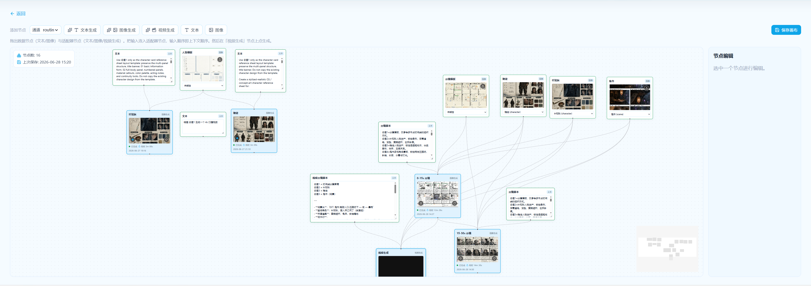

# 镜织 Lensweave

<p align="center">
  
</p>

**视界无疆，剧情自织。**

**镜织** 是一个面向短剧、漫剧与影像叙事设计师的 AI 分镜工坊。它不急着把一段小说或剧情直接推向成片，而是先把故事拆成可以讨论、可以调整、可以复用的视觉材料：人物、场景、道具、镜头提示、参考图与生成节点。设计师可以像整理 moodboard、shot board 和镜头关系图一样，把松散的文本逐步织成可拍摄、可生成的视频段。

这个名字里，“镜”指镜头、视角与分镜，“织”指叙事线、视觉资产、提示词和节点连接之间的编排关系。Lensweave 想表达的不是一条黑箱式流水线，而是一张能被创作者看见和改动的镜头织物：每一条连线都携带上下文顺序，每一个资产都承担角色一致性，每一个生成节点都是一次可回看的创作决定。



上图是镜织的核心工作台：人物、场景、分镜稿、镜头文本和视频生成节点被放在同一张画布上。设计师可以从左上方添加节点、选择生成通道，把素材和提示词按镜头语义连入生成节点；右侧检查器用于编辑当前节点，左侧状态浮层记录节点数量与保存时间。它更接近一张可执行的 shot board，而不是一个只能填写 prompt 的表单。

## 它在帮助设计师做什么

镜织的核心是 EP 工坊。你可以先为一个项目建立人物、场景和道具资产，再进入某一集的画布，把文本节点、图像节点、图像生成节点和视频生成节点放到同一张工作台上。图像和文本按顺序连入生成节点时，画布会保存这些输入的语义顺序；这让“女主参考图、宅院场景、关键道具、镜头提示词”不再只是堆在 prompt 里的文字，而是变成可检查、可重排、可保存的创作结构。

从截图里也能看到它的工作方式：上游资产提供角色一致性和场景基准，中间的文本节点承载镜头意图，生成节点负责把这些上下文编译成图像或视频草案。mock 通道可以让你在没有真实模型密钥时验证完整体验；接入真实通道后，同一张画布可以继续承载图像与视频生成。

## 已支持平台

目前已支持 [Routin](https://routin.ai/) 作为真实生成通道；默认 mock 通道可用于本地体验画布、节点编排与端到端流程。

> 欢迎其他平台提 [issues](https://github.com/nblog/lensweave/issues) 讨论接入。🔌

## Quick Start

先启动后端：

```bash
cd backend
uv sync
uv run ai-drama serve
```

再启动前端：

```bash
cd frontend
npm install
npm run dev
```

- 打开 [http://localhost:3000](http://localhost:3000)，
- 创建一个项目，添加分集，然后进入 EP 工坊。你可以从左侧放置文本、图像和生成节点，把它们连接到视频生成节点上，再点击生成。

> 真实图像或视频生成需要在 `backend/.env` 里配置对应通道的密钥；只想先体验画布和端到端结构时，使用默认 mock 流程就足够（无真实生产）。

## 反馈

任何问题 / BUG，都可以提 [issues](https://github.com/nblog/lensweave/issues)；建议或新增需求会根据情况尽力满足。✨
